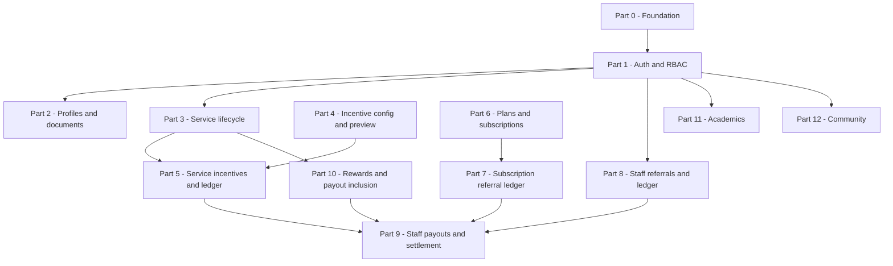

# Delivery and testing breakdown (ship in parts)

This document splits the CRM into **independently testable parts** with clear **Definition of Done (DoD)**, **dependencies**, and **minimum tests** so work can close on time without “everything at once”.

Use it as the master backlog structure: one **part = one releasable slice** (or one sprint theme), not one giant milestone.

---

## 1) Why delivery was stalling

- **Cross-cutting domains** (services + incentives + ledger + payouts + referrals) change together, so one bug blocks “done” for the whole product.
- **Dual paths** (legacy columns vs `incentive_ledger`) multiply test cases.
- **Large controllers** make it unclear which slice owns a regression.

**Rule for each part:** finish **one vertical slice** (UI + API + data + tests for that slice only), then freeze it behind a checklist before starting the next dependent part.

---

## 2) Guiding principles

1. **Order by dependency**, not by excitement (money flows after stable identities and service lifecycle).
2. **Academics and Community** can run **in parallel** with healthcare money work — they share auth only.
3. **Demo seeders** are not “done”; production readiness needs **explicit test data** or staging fixtures, not only `DatabaseSeeder` demos.
4. Each part has **DoD + smoke tests + regression note** before merge.

---

## 3) Dependency overview

---

## 4) Parts (scope, DoD, minimum tests)

### Part 0 — Foundation and environments

**Scope:** Repo runs locally; migrations apply; `.env` documented; **no** accidental demo wipe on shared DB; `optimize:clear` documented.

**DoD**

- Fresh migrate (or documented upgrade path) succeeds on target DB engine.
- CI or documented manual script: `php artisan test` (if tests exist) or **smoke script** checklist in README for this part.

**Minimum tests**

- App boots; login page loads; one authenticated route per main role (see Part 1).

---

### Part 1 — Auth, registration, roles, and redirects

**Scope:** `Auth` module, `User` role helpers, `CheckRole` middleware, post-login routing (admin vs staff vs patient vs academic).

**DoD**

- Each role can log in and lands on the **correct** dashboard (no 403 loops).
- Forbidden routes return 403, not 500.
- Registration with/without referral code does not break (even if referral ledger is stubbed in early waves).

**Minimum tests**

- Matrix: roles × “can open / must block” for 5–10 canonical URLs per role.
- Password reset / OTP paths if used in production.

---

### Part 2 — Profiles and documents

**Scope:** `Profiles` — profile CRUD, avatar, document upload/list, admin visibility if applicable.

**DoD**

- Upload, view, delete (if allowed) works under `public` disk config.
- Authorization: user A cannot read user B’s documents.

**Minimum tests**

- Upload size/type validation; 403 on other user’s document routes.

---

### Part 3 — Service catalog and request lifecycle (without incentive correctness)

**Scope:** `Services` — service types, patient booking, staff assignment, status transitions (`assigned` → `in_progress` → `completed`), admin approval hook **exists**.

**DoD**

- A full **paper trail**: one service request from draft/booking through completion.
- Staff and patient see consistent status and dates.
- **Explicitly out of scope for this part:** final rupee correctness (handled in Part 5).

**Minimum tests**

- State machine: invalid transitions rejected or safely no-op’d.
- Concurrent assignment edge (two staff) if applicable — document expected behavior.

---

### Part 4 — Incentive configuration (admin + preview only)

**Scope:** `Incentives` — rule set, slabs, service/subscription rates; admin preview/read UI; seeders or admin UI to set active ruleset.

**DoD**

- Active ruleset is deterministic (one “current” for calculations).
- Preview screen matches calculator inputs for **sample** staff/patient (documented fixtures).

**Minimum tests**

- Changing inactive vs active ruleset does not break requests with **no** recalculation requirement until Part 5/6 (document policy).

---

### Part 5 — Service incentives and `incentive_ledger` (service path)

**Scope:** `IncentiveCalculatorService` for **service** events; admin approval writes ledger; staff dashboard reads **service** incentives consistently.

**DoD**

- After admin approval, **one** `incentive_ledger` row per service source key (unique constraint satisfied).
- `StaffDashboardController` / incentive details show same numbers as ledger for **service** rows.
- Legacy fallback (`service_types` payout) behavior documented if rates missing.

**Minimum tests**

- Approve twice (idempotency): no duplicate ledger rows.
- Nurse vs caregiver paths; subscriber flag if used; visit count slab boundary (e.g. around 50 visits) with seeded data.

---

### Part 6 — Plans and subscriptions (purchase, payment record, verification)

**Scope:** `Plans` — catalog, subscription create, payment upload/verify/reject, subscription status.

**DoD**

- Happy path: subscribe → verify → active subscription.
- Reject path: subscription not active; no orphan payments.

**Minimum tests**

- Authorization on verify (admin only).
- File or payment payload validation limits.

---

### Part 7 — Subscription sale referral commission + ledger

**Scope:** `SubscriptionService` verify path → `IncentiveCalculatorService` subscription ledger; subscription columns vs ledger consistency policy.

**DoD**

- Referrer gets ledger row when business rules say so; amounts match preview for same inputs.
- UI for subscription referral (staff) shows non-zero when ledger says so.

**Minimum tests**

- No referrer case; inactive referrer; partial amounts; verify idempotency (no duplicate subscription ledger rows).

---

### Part 8 — Staff referrals (codes, completion, ₹ base, ledger sync)

**Scope:** `Referrals` — code generation, registration consumption, completed referral, **ledger sync**, staff referral pages and admin referral views.

**DoD**

- Completed referral always has reconcilable amount: **ledger preferred**, documented fallback for legacy rows.
- Stats “completed count” and “total amount” cannot disagree after backfill policy is applied.

**Minimum tests**

- Complete referral → ledger exists → refresh stats.
- Duplicate code / edge registration attempts (document outcome).

---

### Part 9 — Staff payouts (aggregation, payment run, settlement flags)

**Scope:** `Payments` — `StaffPayoutService`, `AdminPaymentController`, `StaffPaymentController`; ledger settlement and legacy flags where still merged.

**DoD**

- One **payout run** clears the right set of rows; no double pay on repeat “mark paid” for same sources (within defined idempotency).
- Manual payment mode behavior documented (if used).

**Minimum tests**

- Partial payout if amount insufficient (matches product rule).
- Service + referral + subscription + reward lines in one payment if product requires it — or document exclusion.

---

### Part 10 — Patient / caregiver rewards and payout inclusion

**Scope:** `Rewards` — reward lifecycle, amounts, inclusion in `StaffPayoutService`, settlement in admin payment flow.

**DoD**

- Reward appears in pending payout when rules say it should; disappears after settlement.

**Minimum tests**

- Reward without staff mapping (if possible) — error handling documented.

---

### Part 11 — Academics (isolated product slice)

**Scope:** `/academics` full chain: institution → batch → subject → topic → assignment → submission → topic completion threshold → SPI/FPI/ICR → attendance → reports.

**DoD**

- Each role sees only scoped data (institution admin vs faculty vs student checks).
- Submission file rules enforced; student cannot submit ineligible assignment (403).

**Minimum tests**

- Topic completion at threshold boundary (69% vs 71% with small cohort).
- Report period filters (`this_month` / `last_month` / `all`).
- See also: `docs/academics-functional-flows.md`.

---

### Part 12 — Community

**Scope:** Posts, comments, reactions, notifications — auth and role rules.

**DoD**

- CRUD permissions per role; no cross-user data leak on edit/delete.

**Minimum tests**

- Pagination and notification count consistency after actions.

---

### Part 13 — CMS / landing / site settings (if in scope for launch)

**Scope:** `app/Http/Controllers/Admin/*` page content, testimonials, team, site settings.

**DoD**

- Admin-only; uploads stored and served as production expects.

**Minimum tests**

- XSS-safe rendering assumptions (Blade escaping) for rich text if any.

---

## 5) What to avoid mixing in one sprint

| Do not combine | Reason |
|----------------|--------|
| Part 5 + Part 9 in one “big bang” | Incentive bugs hide inside payout bugs. |
| Part 6 + Part 8 without Part 7 | Subscription money and referral money confuse regression attribution. |
| Demo network seeder + production validation | Fake scale hides wrong indexes and wrong totals. |
| Academics + payouts | No shared domain; parallel teams OK, not same acceptance criteria bundle. |

---

## 6) Suggested cadence (example)

| Week | Focus | “Done” means |
|------|--------|----------------|
| 1 | Part 0–1 | Roles and redirects stable |
| 2 | Part 2–3 | Services lifecycle end-to-end |
| 3 | Part 4–5 | Service incentives + ledger trusted |
| 4 | Part 6–7 | Subscription + referral commission trusted |
| 5 | Part 8–9 | Referrals + payouts trusted |
| 6 | Part 10–12 | Rewards + optional Community/Academics polish |

Adjust lengths to team size; **Academics (Part 11)** can start after Part 1 on a **parallel track**.

---

## 7) Traceability: map parts to main code areas

| Part | Primary locations |
|------|-------------------|
| 1 | `app/Modules/Auth`, `app/Core/Middleware/CheckRole.php`, `app/Models/Core/User.php` |
| 2 | `app/Modules/Profiles` |
| 3 | `app/Modules/Services` |
| 4–5 | `app/Modules/Incentives` |
| 6–7 | `app/Modules/Plans`, `IncentiveCalculatorService` subscription paths |
| 8 | `app/Modules/Referrals` |
| 9 | `app/Modules/Payments` |
| 10 | `app/Modules/Rewards` |
| 11 | `app/Modules/Academics` |
| 12 | `app/Modules/Community` |

---

## 8) Related documents

- Architecture and risks: `docs/CRM-FULL-FLOW-AND-ROBUSTNESS-REVIEW.md`
- Academics product narrative: `docs/academics-functional-flows.md`

---

## 9) Optional next step (process)

Add a **single tracking board** (Jira/Linear/GitHub Projects) with **one epic per Part** above, and **only** child tasks that fit that Part’s DoD. Anything that spans two Parts gets split before it enters a sprint.
